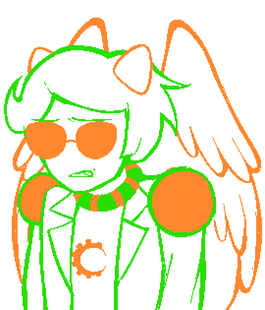

## Prologue / Chapter 1

You are now Vriska, and like any good Main Character, you find yourself on the precipice of an all too familiar cliff.

VRISKA: Wow, hell was right.

VRISKA: You h8 to see it.

What will you do?

VRISKA (angry): What do you MEAN what will I do????????

VRISKA: Davepeta, is that you?

VRISKA (thinking): ...

VRISKA (smug): Wow once again it falls to me to figure all this shit out in any sort of meaningful way.

VRISKA (idle): ...

VRISKA (angry): And why the fuck is Tavros here!!!!!!!!

TAVROS: i PROBABLY DON'T, uHH, WANT TO QUESTION, yOUR METHODS

TAVROS (nervous): aND MAYBE, iF THERE WERE A BRAVER VERSION, oF ME, hERE, HE MIGHT SAY, tHAT UM, iT'S BECAUSE USUALLY, tHAT MAKES YOU MAD

TAVROS: bUT SINCE THERE ISN'T, a VERSION OF ME LIKE THAT HERE, i GUESS IT'S BECAUSE I, uHH

TAVROS (smiling): lIVE HERE MOSTLY,

VRISKA: Shut the fuck up Tavros!

VRISKA (thinking): This is o8viously some sort of trial.

VRISKA: Cleeeeeeeearly I'm 8eing faced with the ghosts of my past and I have to "sort it out" or some horse shit.

VRISKA: Thanks for the guidance, Nepadave, or whoever the literal hell.

VRISKA (smug): 8ut I got it all figured out already!

VRISKA (thinking): I'm going to speedrun enlightenment and save this horri8le fake universe from imploding in on itself.

VRISKA (smug): You're welcome.

TAVROS: oK WELL, i WILL PRETEND THAT, uHH

TAVROS: iF I WAS SOMEONE, wHO DIDN'T UNDERSTAND, wHAT YOU WERE SAYING,

TAVROS (nervous): bECAUSE, i'M FEELING PRETTY ALIVE FOR THE MOST PART, i THINK

TAVROS: tHAT PERSON, tHAT I'M PRETENDING TO BE, mIGHT ASK

TAVROS (smiling): wHY, yOU THINK THAT IM A GHOST,

VRISKA: You still have legs, for one.

TAVROS: oH THANK YOU,

TAVROS: tHAT IS A NORMAL THING, fOR YOU TO SAY, aBOUT GHOSTS,

TAVROS (smiling): i SEE UM, yOU ALSO, hAVE LEGS

TAVROS (nervous): wHICH MIGHT BE A GHOST THING, tHAT I AM MOSTLY, uNAWARE OF

TAVROS: sO, mAYBE, wE ARE BOTH GHOSTS,

TAVROS (smiling): }:)

VRISKA (thinking): I've already done this, though.

VRISKA (smug): I reconciled with Tavros days ago.

VRISKA: I'm completely in the clear! He forgave me already.

TAVROS (nervous): fOR WHAT,

VRISKA (thinking): It couldn't 8e that easy, could it?

VRISKA: Hey. Tavros.

TAVROS (smiling): hI THAT'S ME, i THINK,

VRISKA: I'm sorry I killed you.

TAVROS: dID YOU DO THAT,

What will you do?

VRISKA (idle): 

VRISKA: ... damn.

VRISKA (smug): Well I guess it wouldn't 8e worth anything if it were that simple.

TAVROS (nervous): uM VRISKA DID-

VRISKA (angry): Ugh!!!!!!!!

VRISKA (thinking): What did they mean "sort it out," then? I feel fine a8out killing Tavros, and he's certainly ok with it now. The situation's sorted!

TAVROS (smiling): iS THAT TRUE,

VRISKA: It's completely sorted!

VRISKA: Damn, it could have 8een any num8er of things.

VRISKA (smug): I did a lot of things wrong.

VRISKA: Hey Tavros, I'm sorry I made you an accomplice to a really awesome assassination that I got my ass kicked for, 8ut then I 8ecame a god so 8asically it was the right thing to do.

TAVROS (smiling eyesclosed): ...

What will you do?

VRISKA (thinking): No dice, huh? Okay, try this one on for size!

VRISKA: I'm sorry I kissed you and then used mind control to make you try and love me that one time. That one's on me.

TAVROS (smiling): ...

What will you do?

VRISKA: Fuck, that was a good one... this character growth shit is hard.

### {Hours later, but not many.}

VRISKA (sad): ...I'm sorry I said your lusus "smelled like tears".

What will you do?

VRISKA (angry): FUCK!!!!!!!!

VRISKA (thinking): I'm really scraping the 8ottom of the 8arrel here...

VRISKA: and I'm 8eing sincere a8out at least 80% of these!

TAVROS (nervous): aS MUCH FUN, aS I THINK YOU MAYBE THINK WE ARE MUTUALLY HAVING

TAVROS: aND, i DON'T WANT TO RUIN THAT, bY

TAVROS: bEING MY USUAL SELF, lIKE YOU ARE ALWAYS TELLING ME IS BAD,

TAVROS (nervous): a LOT OF THOSE THINGS, sEEM, uM

TAVROS (smiling): uNIMPORTANT AND SORT OF, nORMAL,

TAVROS (nervous): fOR YOU,

VRISKA (thinking): 

VRISKA (smug): You're right.

VRISKA (idle): ...

VRISKA (idle): ...

What will you do?

VRISKA: Damn it. Well even if that doesn't solve this puzzle, 8y some happenstantial miracle it's still true.

TAVROS: i THINK IT'S, sOMETIMES ALRIGHT

TAVROS: tO JUST STAND, tOGETHER,

TAVROS: oUTSIDE OF MY HOUSE, fOR A FEW HOURS, aND,

TAVROS (nervous): i AM NOT AT ALL

TAVROS: fRIGHTENED, tHAT YOU WILL DO SOMETHING,

TAVROS (smiling): hORRIBLE TO ME,

VRISKA: Incredi8le! Listen to you!

VRISKA: You have me here practically groveling at your feet.

VRISKA: And even after all I put you through, you're still not trying to get your just desserts.

VRISKA (sad): All this apologizing and rolling over and exposing my weaknesses isn't solving shit!

VRISKA (smug): It's like I'm always saying, words are meaningless.

VRISKA: What we need is action.

TAVROS (nervous): i THINK MAYBE, tHAT,

TAVROS: dOING uHH, "ACTIONS,"

TAVROS: mIGHT BE ONE OF THE THINGS, tHAT YOU FEEL, lIKE YOU DID WRONG

TAVROS: aND, mAYBE SOME WORDS, aCTUALLY,

TAVROS (smiling): cAN BE PRETTY USEFUL, sOMETIMES,

VRISKA: That sounds wrong, so I'm going to completely ignore it.

TAVROS: oH, oK,

VRISKA: 8ut sure. Let's try it your way.

TAVROS (smiling eyesclosed): oH, oK,

VRISKA: Instead of me taking action, what I need is for you to take action.

VRISKA (smug): It was so o8vious that it's stupid, actually.

TAVROS: tHAT'S NOT, wHAT I SAID, aT ALL,

VRISKA: The reason I'm stuck here is 8ecause I don't owe you plac8ing apologies

VRISKA: I owe you revenge. It's just that easy!

TAVROS: bUT-

VRISKA (smug): It's just that easy!

TAVROS (idle): ...

VRISKA (angry): IT'S J-

TAVROS: bUT WHAT IF, sOMEONE WERE TO SAY, hYPOTHETICALLY SPEAKING,

TAVROS: i DON'T THINK THATS THE THING I WANT TO, uMM, bE DOING

TAVROS (nervous): aT ALL, oR, eVEN SORT OF,,

TAVROS: aND THAT I STILL THINK IT WAS WRONG BUT I FORGIVE YOU FOR DOING THOSE THINGS THAT YOU SAID YOU DID, tO ME EARLIER,

VRISKA: No. You deserve revenge. Action 8egets action. This makes perfect sense to anyone who's 8een paying attention.

VRISKA (thinking): 

VRISKA: You have to throw me off this cliff.

VRISKA: Then we'll 8e completely squared away.

TAVROS (nervous): uHH I DON'T THINK-

VRISKA (smug): I'm praaaaaaaactically an expert on this revenge thing. Trust me.

TAVROS: vRISKA I DON'T WANT TO DO A REVENGE ON YOU

TAVROS: fOR CRIMES, yOU HAVEN'T REALLY DONE, aND MAYBE SOME YOU DID,

TAVROS: aND THIS MAY, uHH, sEEM COUNTERPRODUCTIVE, tO YOUR IDEA

TAVROS (nervous): bUT IT SOUNDS LIKE, bEING THROWN OFF A CLIFF MIGHT NOT BE A HEALTHY COPING MECHANISM,

VRISKA: It's fine! Kill me, get your revenge, and I'll finally 8e on my way.

VRISKA (smug): Out of your life forever! Never to torment you again!

VRISKA: And whatever version of you this is can go on living your little life playing with your little monster dolls or whatever!

VRISKA (sad): Here on Alternia.

VRISKA (sad): 8efore everything goes wrong.

VRISKA: You can kill me now 8efore it's too late for you.

VRISKA (sad): 8efore I screw your life up.

VRISKA (smug): It's perfect!

TAVROS (nervous): nO I DON'T WANT TO DO THAT,

VRISKA: I know you have it in you. I've seen it.

VRISKA (angry): God damn it Tavros, if you don't kill me I can't move on.

VRISKA: You'd 8e doing me a favor.

VRISKA: Go on.

TAVROS (nervous): uHH,

VRISKA: Kill me.

TAVROS (nervous): nO,

VRISKA (angry): Hey get 8ack here!

TAVROS (nervous): nO!

VRISKA (angry): Stop running!

TAVROS: nO, i LOVE TO RUN AND, i DO NOT PLAN ON STOPPING, aNY TIME SOON,

VRISKA (angry): You kill me right this instant!

VRISKA: Damn it, I forgot how fast he used to 8e.

TAVROS: nO!

VRISKA (smug): Man, doing the right thing sure is hard work.

VRISKA: I didn't want to do this, Tavros, 8ut you're forcing my hand here. I won't make the same mistake again.

### {Thief: Do the right thing.}

### {It's really for the 8est.}

VRISKA: Good luck.

### {Adios, Toreador.}

### {==>}

### {==>}

TAVROS: uHH, oH SHUCKS, bYE VRISKA,

### {==>}

> "You are now Vriska, and like any good Main Character, you find yourself on the precipice of an all too familiar Beach.
> 
> What will you do?"

YEAR 2

DAVEPETASPRITE^2: B33 < *dp pads through the underbrush of the forest, leaving paw prints after themselves in the freshly fallen snow*

DAVEPETASPRITE^2: B33 < *their ears twitch cutely with every step they take beclaws as perfect a creature as they are cats are still too fucking stupid to invent proper p33ts protectors*

DAVEPETASPRITE^2: B33 < *they will probably need to get these silly little beans amputated after walking through all this white shit but whatever its fine, at the end of this tail is an important furiend*

VRISKA: ...

DAVEPETASPRITE^2: B33 < every year farmers and freaks alike crowd around this curious critter wringing their sweaty boring human hands all nervously hoping for winters end

DAVEPETASPRITE^2: B33 < but this overhyped moles shadow offurs a symbolic appouncement for the spider instead

VRISKA: ........

DAVEPETASPRITE^2: B33 < the breaking of cycles, dissolution of the self, whatever other philosophical rhetoric bill murray said in that one meowvie

DAVEPETASPRITE^2: B33 < its all up to you, spider, to grab this guy by the furry haunches bend him over and nonsexually spank him into submewssion

DAVEPETASPRITE^2: B33 < what will you do vriska?

VRISKA: *The spider doesn't do anything, 8ecause spiders don't have 8rains to make good choices. Instead, we're doomed to crawl around on our 8ellies like idiots, w8ing to 8e crushed under the giant furry ass of an animal so pathetic humans had to make up reasons to care a8out it, and with her luck she'll spend eternity 8uried alive under poop pellets du88ed the pharaoh of trash assholes and praying to die.*

DAVEPETASPRITE^2: B33 < vriskers not to ask an obvious question but

DAVEPETASPRITE^2: B33 < are you good?

DAVEPETASPRITE^2 (uncomfortable): B33 < you s33m... depressed

VRISKA: What are you talking a8out?

VRISKA: Isn't it o8vious how excited I am?

VRISKA: 8anging my head against a wall for several hours is practically my daily medit8tion now.

VRISKA (angry): "Purrhaps" today will 8e the day I finally give myself a deep enough pan lesion that my neurons will reset and I can finally understand what I'm supposed to 8e doing here.

VRISKA: Finally moving on FROM THIS 8ORING M8ND NUM8ING SHIIIIIIITTY PUNISHM8NT PIT.

DAVEPETASPRITE^2: B33 < wrow

VRISKA: Sigh.

VRISKA: Can you please tell me what to do? And not in some coy, rounda8out way like you have 8een.

VRISKA: You're supposed to 8e guiding me, 8ut instead sweeps of my life are 8eing w8sted here when I could 8e doing so much more out there.

DAVEPETASPRITE^2: B33 < trust me im trying!!

DAVEPETASPRITE^2: B33 < my advice is just... a litter bit limited

DAVEPETASPRITE^2 (thinking): B33 < ask me about mechanics or some dank catnip or even how to stunt down the stairs without breaking every bone in your body and i can chitter your ear off for another couple years

DAVEPETASPRITE^2: B33 < but countless cool dudes and kitty girls cant inform much on how to handle those classic serket problems

DAVEPETASPRITE^2 (pokerface): B33 < feel me?

VRISKA: Soooooooo what you are saying is you can't help 8ecause you are the Ultimate Winged Weener and can't relate to 8eing a huge 8itch like me?

DAVEPETASPRITE^2: B33 < ha he

DAVEPETASPRITE^2 (pokerface): B33 < w33ner

DAVEPETASPRITE^2 (cute): B33 < but yeah thats pretty much how it is

DAVEPETASPRITE^2: B33 < you know what they say theres purrppets and then theres pawppet33rs

DAVEPETASPRITE^2: B33 < and both mew selves rather be on the yarn strings

DAVEPETASPRITE^2: B33 < so alot of my thoughts on how to come back from all your bullshit begins and ends at "i simply would not have done that in the first place"

DAVEPETASPRITE^2 (pokerface): B33 < no judgment of course

DAVEPETASPRITE^2 (thinking): B33 < see if you had watched the damn groundhog movie youd have all the relatable advice youd n33d

VRISKA: I will never ever watch that stupid groundhog movie!

VRISKA: This is such 8ullshit. Like you're some softy, hurt-no8ody housecat! You literally defe8ed Lord English and kill wild animals with your 8are h8nds!!!!!!!!

DAVEPETASPRITE^2: B33 < ok hunting is way different

DAVEPETASPRITE^2: B33 < blood and guts and broken wrists and fractured tailbones

DAVEPETASPRITE^2: B33 < thats nature and instinct it doesnt have to be mean

DAVEPETASPRITE^2 (roleplay): B33 < *the fearsome gender neutral lionesster pins down its prey but instead of getting down to business growls out how the prey deserves this for being a big disappointing pussy*

DAVEPETASPRITE^2 (uncomfortable): B33 < s33 very weird

DAVEPETASPRITE^2 (cute): B33 < i might have to eat a guy but that doesnt mean i cant respect them

VRISKA: 8ut what if the natural order is exactly what's working against me here?

VRISKA (angry): Wh8t am I supposed to do then????????

DAVEPETASPRITE^2: B33 < sure hope thats not true...

DAVEPETASPRITE^2 (cute): B33 < or well be here furrever!

*[A chapter select screen appears. The remaining chapters are selected from this screen.]*