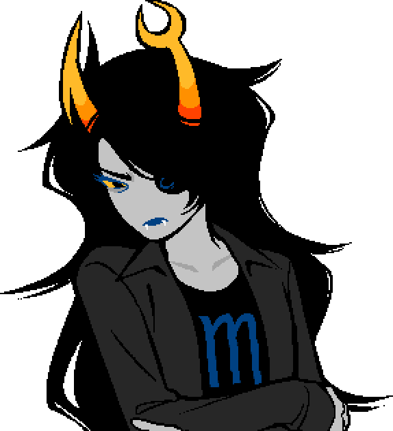

## Chapter 3

### "YEAR 4"

NANNASPRITE: Oh there you are!

NANNASPRITE: Feeling like you're getting your lucky mojo back again?

VRISKA: Not really. ::::/

VRISKA: 8ut everyone has 8een trying so hard to cheer me up, I thought I'd give it another try.

NANNASPRITE: Tell Nanna about it, you know how I love a good bit of girl talk.

VRISKA: I don't want to 8ore you, it's just the same pro8lem as always.

VRISKA (sad): Finally I get my sea legs and figured out what this whole process is a8out, 8reeze through Eridan and John and Kanaya, only to get stuck all over again on HER.

NANNASPRITE: Well I am sure there is some common thread, every trial you face is designed to better prepare you for the next.

VRISKA: I'm not so sure........she's different from the rest of them. And no matter how I approach this, I can't figure out what the hell she wants.

NANNASPRITE: You'll figure it out sooner than you expect, deary! I have the utmost faith in you.

VRISKA: Thanks Nannasprite! Honestly having you and Nannasprite 2 here has made this whole experience way more 8earable.

NANNASPRITE (giggle): You know what they say, flattery will get you all the cookies two lovely aged blue ladies can fit in one oven.

VRISKA: Hell yeeeeeeees!!!!!!!!

VRISKA: It's funny thinking 8ack on it, John and I actually had a conversation a8out you sweeps ago.

VRISKA (smiling): We kind of 8onded over how, past our cultural differences, we shared this same experience of connecting to our predecessors through their writings.

VRISKA: I'm glad he finally got to meet you. I hope he appreci8ted every minute of it!

NANNASPRITE (giggle): Oh ho, I'd like to think so!

NANNASPRITE: I miss that boy, he could be such a pill at times but we had some lovely chats. Always sung his heart out during our little “jam seshs,” too.

VRISKA (smiling): Doooooooork! Can you 8elieve he has his own little progeny now, strutting his shit in that same oddly secure, self-assured way?

VRISKA: I wonder how those kids are doing right now........

VRISKA: What exactly do humans get out of these familial prim8 relationships, anyway?

VRISKA: Is it a chemical manipulation thing?

NANNASPRITE: Some would say so, and of course there is some truth to that.

NANNASPRITE: That said, it's hardly the whole story... People are much too concerned with trying to boil down these kinds of marvelous profundities to cold hard facts.

NANNASPRITE (giggle): I'd go blue in the face trying to lay out every rhyme and flimsy whimsy a person could have for baking up a brood, hoo hoo!

VRISKA: You prolifer8ed yourself though, right? Why?

NANNASPRITE: Hm. There was a beautiful sense of novelty to it, I suppose.

NANNASPRITE: Like both John and you, my role model was my own tome of japes, left behind by my dearly departed adoptive father.

NANNASPRITE: It never sat right with me, how limited my experience with actual humans was.

NANNASPRITE: I couldn't exactly bring that man back from the dead, but I could put myself in his shoes and do the bang up job he never had the opportunity to do. Not to mention, I like babies! :B

VRISKA: That's it?

VRISKA (angry): I don't know, couldn't you have done anything else? What's so special a8out 8a8ies? I saw one in passing and they're weird as hell! Rose told me they even pee their damn pants!

NANNASPRITE (giggle): They sure do! Sometimes, they'll even pee on you too.

VRISKA (jaw drop): They pee ON people!

VRISKA:  What........

VRISKA: That sounds like a nightmare.

NANNASPRITE (giggle): It is! One time my son laughed at me as it was happening!

VRISKA (angry): Uuuuuuuugh!!!!!!!!

NANNASPRITE: He was right, though. It was funny.

VRISKA: So that was it? There wasn't anything else you wanted in life? You were fine with pee?

NANNASPRITE: Well I was fairly enamored of the idea of getting even, once upon a time.

NANNASPRITE: So many nights spent plotting that awful woman's downfall and making her pay for all the indignities of my childhood. For always making me feel like I was powerless to do anything. 

NANNASPRITE: For a while I even thought it was my fate!

VRISKA: Yessssssss! That's what I'm fucking talking a8out!

NANNASPRITE: Hush up now, none of that! Fantasizing about all that even after my own death and resurrection is absurd!

NANNASPRITE: Not to mention that now, after seeing what my younger self has gotten up to in this realm, I clearly underestimated the depth of my own desires.

VRISKA: C'mon, we're not doing this again. You can't keep comparing yourself to her! She's a freak and you're like the least freakish person I've ever met.

NANNASPRITE (serious): I'm not trying to get down on myself, deary, it's simply a fact of reality. I'll never know if any of my schemes coming to fruition would have left me satisfied, and now I highly doubt it!

NANNASPRITE (serious): The past is always going to be the past.

VRISKA: ...

NANNASPRITE: It's all a bit embarrassing, really... All that said, watching your progress these past few years has inspired me to frame the whole debacle a bit differently.

VRISKA: Oh?

NANNASPRITE (serious): I had always wanted Betty Crocker to know what a mistake it was to steal my life, my potential, from me.

NANNASPRITE (serious): But the real issue was that not once during my childhood did I ever feel particularly wanted, or welcomed, into the world. I only had my brother, and even he ran off on me!

NANNASPRITE (serious): Yet despite that fact, and the anger and the disappointment, I still raised someone who knew what it was like to be loved.

NANNASPRITE (serious): I never once questioned choosing my son over some run of the mill escapade or rousing romp. And while in my twilight years of retired spritehood, I have often pondered the “could be.”

NANNASPRITE: Seeing that choice isn't innate to every iteration of Jane Crocker has assured me that I did indeed fulfill a path of potential to its fullest degree. I'm grateful to her for that... marginally.

VRISKA: I guess that makes sense. Weren't you worried, though? That you weren't following the right path, or living up to your destiny?

NANNASPRITE (giggle): I never even considered that, hoo hoo!

NANNASPRITE: Is that how you kids think these days? My lord, no wonder none of you go outside anymore.

VRISKA (angry): Don't p8tronize me, old lady! Destiny's the found8tion of my godhood!

NANNASPRITE: True. I am only a simple elderly woman, stand-mixed with the unknowable secrets of the universe and a one-armed clown doll. But from experience, I would still argue that destiny mostly fulfills itself.

NANNASPRITE (wink): There are many more important things you should focus on, such as getting the heck out of here!

VRISKA: Wow, I've 8een pep-talked and I didn't even realize it. You have a point, though... It's not like I have any other plan 8ut to keep trying.

VRISKA (sad): Also, sorry for getting snippy there. <::::(

NANNASPRITE: Don't fret over it dear, a blue gentlewoman appreciates a bit of bite to her compeers.

VRISKA (smiling): See Nannasprite, you're the only one that gets it. You're a real one.

NANNASPRITE (giggle): DAMN right I am.

VRISKA: Woah, getting crazy now.

NANNASPRITE (giggle): Tee hee! <;B

VRISKA: <33333333

### \>  {Choose Mindfang's Journal.}

*[Fade to white.]*

### \>  {????????}

The girl was thrown into emptiness.

Despite the darkness, the space wasn't foreign. The way the moons hung in the sky, the sound of the waves as they crashed, the 8reeze, these were all familiar sens8tions.

As was the figure 8efore her. Though she had only ever seen it 8ehind her eyes, its form was shaped 8y words.

VRISKA: You can drop the ominous 8uild up, I already know the twist.

Oh? Had the thief 8een here 8efore?

VRISKA (stoic): Yep! In 8rief summary, at least once a week for the last 2 years.

VRISKA: 8roaching every kind of chit chat that goes a8solutely nowhere.

VRISKA: The whole endeavor usually ends with me either killing you or... feeding myself to you.

VRISKA (angry smiling): And for some reason, you talk like a 8ook. Which is a huge head8che, 8y the way!

Well she was a 8ook, our esteemed narr8tor. That's how Vriska knew her, at any r8te. And unlike a certain someone, she knew the value of showmanship.

VRISKA (angry smiling): Yeah, you really shook me the first time around.

VRISKA (angry smiling): You were all like, “Surprise, 8itch. I'm 8oth the Marquise, and your lusus!” And I fell str8 on my ass, flipping the fuck out like a 8ig tool.

VRISKA (stoic): 8ut FYI, after the last hundred or so reveals, it just comes off as trying waaaaaaaay too hard.

Hmph!

*[SFX. A chittering noise.]*

*[The screen shakes, and fades to...]*

VRISKA (stoic): Hi Momfang.

VRISKA (stoic): It's 8een a 8it. How are you?

The spider did not pause to find an answer; she already had one.

“HUNGRY. KILL. EAT. SHIT. DEATH.”

VRISKA: So same as usual! Awesome. Glad to hear it.

VRISKA: So what's on the agenda this time? Do NOT say revisiting how I found that old journal, or my first feeding.

(thinking annoyed) Would the spiderling prefer returning to the day she got stuck in this we8 and had to eat her way out?

VRISKA (angry): No!!!!!!!! I do NOT want to 8e a kid again, period.

What a8out the day her lusus died?

VRISKA (angry): Done that! Sick of it! I always almost drown in 8lood, and it makes the whole canyon smell terri8le.

VRISKA (angry): It's 8ad enough 8eing stuck 8ack in this place. If you go down memory lane again, I'm jumping.

The girl was 8linded 8y her pup8ed angst. As 8efouled as those we8s were, this gossamer carnage had 8een home, once. Her time here made her who she was.

VRISKA (stoic): Is that why we're here, in argua8ly one of my least favorite places to exist?

VRISKA (stoic): Instead of telling me my own origin story, can we skip to the end where I clear this shit once and for all and move on to someone that matters?

(thinking annoyed) The Thief's request was denied 8y the narr8tor, who wondered if it would kill the younger Serket to colla8or8. Had she not once intric8ley woven her own daring campaigns? What happened to that thespian vivacity?

VRISKA: I don't know if it's a f8tal symptom of watching the sweeps go 8y, 8ut FLARPing isn't as fun anymore. A lot of energy and drama for nothing.

(thinking annoyed) That statement was so un8elieva8le as to 8e almost insulting. Who could deny a little drama? Everyone appreci8ted a good game. Especially the girl.

VRISKA: Ok, yes, I am attached to the struggle. 8ut 8ack then, all that satisf8ction was pretty short lived.

VRISKA (sad): Every win, I had to share with her. Every moment, I felt her w8ting for me. It feels 8ad, not getting a choice when you do all the fucking work.

When we were sailing the high seas, we did not exhaust our exploits with self indulgent contrition.

Daily we made 8ets with death, and whichever faulty panlo8es occasionally sparked empathetic were rightly silenced, that we might revel in our winnings undistur8ed. We have always taken what we wanted 

VRISKA (sad): Sure, the 8ooty was gr8, up until the point where there was no one left to play with. After that, it was all as good as gar8age.

That spoke to a pro8lem with the girl's mindset. Trolls died. On a planet 8uilt to 8reed killers, was that such a 8ad thing?

Little spider8ite 8eat them all. Not 8ecause she was talented, or smart, or particularly strong, though she was all of those things. It was 8ecause she learned the rules 8efore anyone else did. 

VRISKA (stoic): So I'm only alive thanks to you? 8ecause you were just that necessary and important?

It was true.

“GRU8.”

VRISKA (angry smiling): 8ZZZZZZZZT WRONG! I'm not falling for that hoofshit again.

VRISKA (angry smiling): I've already tried respecting you for making me the 8est, 8ut you know what I'm realizing?

VRISKA (angry smiling): I didn't have to go through aaaaaaaall of THAT to 8e strong. Vrissy didn't!

VRISKA (angry): Even growing up in a f8ke world where no one has a spine, and with 8arely any guidance, her powers can do things mine can't.

VRISKA (angry smiling): So what silver lining is left, honestly?

........

VRISKA (angry smiling): 8ut that's the point, right?

VRISKA: There is no p8sitive spin, no learning to appreci8 you, 8ecause even 8y Alternian st8ndards you sucked!

VRISKA (angry): You weren't a cust8dian, you were a responsi8ility.

VRISKA: I protected you, I c8red for you, and you would have happily killed me the moment things didn't go your w8y.

And?

VRISKA (jaw drop): Th8t's not fucking norm8l!!!!!!!

It was for a spider.

VRISKA (sad): God, you're insuffera8le!!!!!!!!

VRISKA: I had one place I was supposed to feel safe.

VRISKA (angry): Why did you h8ve to 8e everything wrong with the w8rld, rolled into one terri8le monster?

The spider has no answer to that. She has never once thought of her own n8ture. She has only ever lived and devoured.

"HUNGRY. KILL. FUCK. EAT. FEED."

VRISKA (angry): I KN8W YOU'RE HUNGRY! What a8out me? My entire gru8hood, I gave and you took. F8r once, what a8out what I w8nt?!

She has never considered this.

And wasn't considering it now, to 8e clear.

8ut the narr8tor was curious, what DID the spiderling want from the monster?

To hear her say “THANK YOU” for the young girl's service, for her to 8e “SORRY"?

VRISKA (angry): What I w8nt is for you to go 8ack in time and pr8tect that fucking kid, like you were supposed to!!!!!!!!

VRISKA (angry): If you did, may8e I'd 8e a8le to relax and let my f8cking guard down for ONCE, instead of const8ntly ruining things and thinking everyone is going to turn around and kill me!

VRISKA: Oh my god.

VRISKA (angry): Tavros was right!!!!!!!!

"FOOD?"

VRISKA (angry): Sh8t the f8ck up!!!!!!!!

VRISKA (angry): Now I get why talking to all my friends finally led up to you.

VRISKA (angry): Y8u're the reason why I could never trust any8ody!

VRISKA (sad): Even h8r!!!!!!!! Especi8lly her.

VRISKA: I was so terrified of getting it wrong, so I'm stuck following in the footsteps 8f the M8rquise.

And what, thought our intrepid narr8tor, was so 8ad a8out that? She'd always seen herself a comfort to the young troll.

She taught her descendant so much, and in such lurid detail.

VRISKA: It was 80% smut!!!!!!!!

It was a well written, one-of-a-kind historical document that mapped out all the swash8uckling majesty of a 8rilliant woman's destiny.

VRISKA: Of course you'd s8y that, you wr8te it!

VRISKA: 8ut sure, y8u helped keep me alive, and m8de me a wicked pir8. Unfortun8tely, it made everyone else h8 me!

VRISKA (sad): I could have 8een any8ody... and you took that aw8y from me. You made me afraid of it.

“STUPID. STUPID. STUPID. STUPID. STUPID. STUPID. STUPID. STUPID.”

The girl has to 8e reminded, she is not special.

She is not the victim of some gr8 tragedy.

She is an apex predator. A 8iological, existential threat to all those that cross her path. She thought showing weakness would have solved all her pro8lems? Those irrelevant victims she spent so much time mourning didn't want her companionship.

They wanted to make new holes inside of her, to ensure their own survival.

“IDIOT.”

VRISKA (angry): Stop it, I don't want to think like that anymore!!!!!!!!

It was the girl's 8irthright to 8e voracious and awful. Those 8lueprints could not 8e a8andoned. The spider, the narr8tor, the child, they were all looking into the same mirror.

“TRAPPED.”

VRISKA (angry): PLEASE!!!!!!!! I kn8w, 8k!?

VRISKA (angry): Why didn't you just st8y de8d!!!!!!!! Why didn't I k8ll y8u s88ner!!!!!!!! I should h8ve s8ved myself 8efore it was too l8!!!!!!!!

8ut even as she said it, the Thief knew that was never an option.

Emancip8tion couldn't 8e granted to either party, only mutually assured destruction.

VRISKA (jaw drop): ........

VRISKA (sad): I wish it had 8een different.

Impossi8le.

VRISKA (sad): I wish I was 8orn some8ody else.

Another dead end.

VRISKA (angry): Fine, fuck!

VRISKA (angry): JUST LET M8 GET 8UT FROM UNDER Y8U, THEN! L8T ME 8E MY OWN F8CKING PERSON, F8R ONCE!!!!!!!!

What will you do?

VRISKA: ........

“HUNGRY.”

VRISKA: Huh.

“KILL.”

VRISKA: You know, every week I come in here trying to figure out what more you could possi8ly want from me, and every week it's the same shit.

VRISKA (smiling): I really am suuuuuuuuch a moron.

“FEED.”

VRISKA (smiling): Exactly. It was never any deeper than that, the answer was right in front of my face.

VRISKA: Well. I'm not your free meal ticket anymore.

M8ricide, then?

VRISKA: Nah.

VRISKA: I never really wanted that either.

Lest the girl forget, there were only two choices.

“DIE.”

VRISKA (stoic): 8ut that's not true. I'm not a wiggler anymore. Alternia is dead.

VRISKA (smiling): For once in my life, I have options.

And just what did the ungrateful little upstart mean 8y that?

VRISKA (proud): I'm glad you asked!

VRISKA (proud): It means I finally get to walk away from all this. And I'm not going to look 8ack.

The spider forgot her hunger, for a moment at least, as the reality of such a statement sunk in.

She was only a spider. She did not fear death, or feel regret, or hold any sadness.

She never once loved the girl. She did not feel responsi8le.

That said, the arachnid had grown accustomed to the smaller creature's presence.

She extended one long, spindly leg 8efore her, towards the young troll.

As if to say, "HUG?"

VRISKA (stoic): Oh, a8solutely not.

VRISKA (stoic): Hell no.

That proved a good call, as the spider had 100% planned on eating the girl.

Instead, the long lim8 was retracted, placed 8etween the monster's own massive jaws.

*[Pause. SFX: A reverberating crunch.]*

The spider would not notice when the girl turned to leave.

And the girl would not turn around to see if she had.

The 8ound cover was closed on our trusted narr8tor, as she whispered these final words.

“Good luck, Vriska. 8e assured, you will need it.”

*[SFX: Reverberating footsteps, slowly walking away.]*

### \>  {Level Complete!}

*[Fade to white.]*

