## Chapter 4

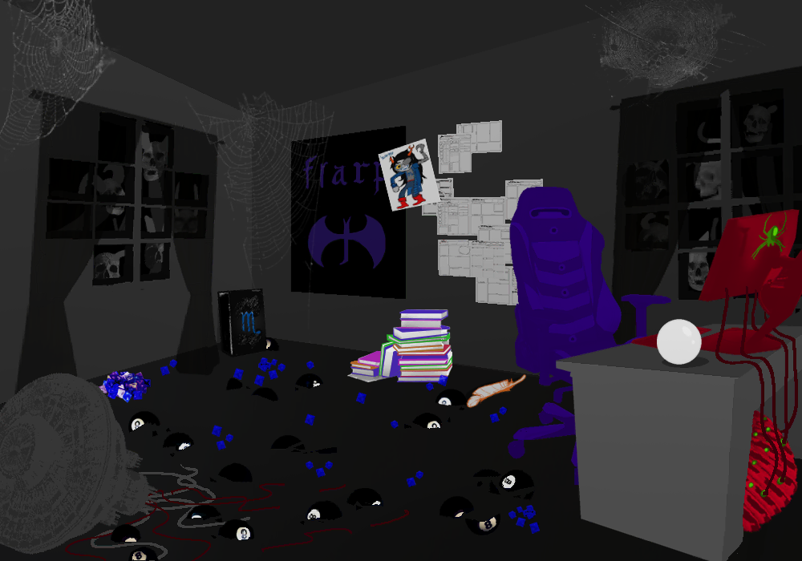

VRISKA: Whew.

VRISKA: Long day.

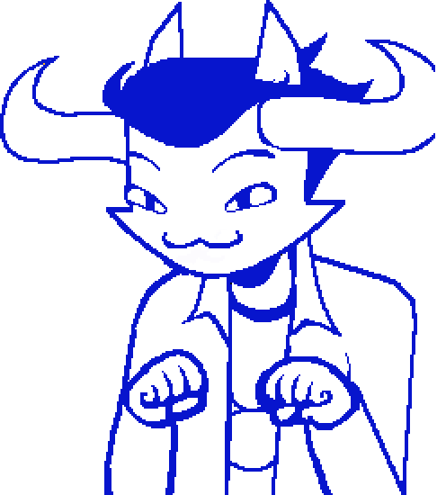

GCATAVROSPRITE: mAYBE, yOU SHOULD TAKE A BREAK, fROM ALL THE TOTALLY AWESOME PERSONAL BREAKTHROUGHS YOU ARE HAVING,

GCATAVROSPRITE: aND KICK IT WITH ME AND ERISOL FOR A WHILE,

ERISOLSPRITE: yeah, you kiinda look liike 2hiit.

VRISKA: Says Scarfshades McLopsided.

ERISOLSPRITE: 2ay2 the bu2ted a22 biitch wweariin the 2ame raggedy jacket 2he2 wworn 2iince wwe wwere liike fiivve.

VRISKA: Says the guy who literally can't change his clothes.

ERISOLSPRITE: ii cant be held accountable for my dii2cordant cla22-2wwag diichotomy, but here you are a 2wweep and a half deep iin a per2onally taiilored realm of 2elf-reflectiion and you 2tiill choo2e twwo look liike thii2.

VRISKA: Heh.

ERISOLSPRITE: heh.

ERISOLSPRITE: anyway, come chiill.

GCATAVROSPRITE: oR, iNSTEAD OF CHILLING,

GCATAVROSPRITE (mischievous): wE COULD THROW AROUND A BALL OF YARN, oR SOMETHING ELSE VISUALLY STIMULATING, tHAT MIMICS MY PREFERRED QUARRY OF SMALL ANIMALS I COULD KILL FOR FUN AND NOT EAT,

GCATAVROSPRITE (mischievous): aND I COULD CHASE IT WITH MY LEGS,

GCATAVROSPRITE (mischievous): tHAT AREN'T LEGS, aND ARE ACTUALLY A GHOST TAIL,

GCATAVROSPRITE (mischievous): wHICH REALLY HAS NO BEARING ON MY ABILITY TO MOVE AT ALL,

GCATAVROSPRITE (mischievous): aNYWAY,

GCATAVROSPRITE (mischievous): tHE IMPORTANT THING, iS THAT YOU SHOULD PROBABLY GET SOME R AND R,

GCATAVROSPRITE (mischievous): aND ALSO HAVE A VERY VIGOROUS PLAYTIME SESH, wITH THE BOYS,

GCATAVROSPRITE (mischievous): aND MAYBE GET WICKED PRANKED ON,

GCATAVROSPRITE (mischievous): sO YOU DON'T BURN OUT,

GCATAVROSPRITE (mischievous): }:3

GCATAVROSPRITE (sneeze): aCHOO!

ERISOLSPRITE: dude, 2neeze iintwwo your fuckin 2houlder or 2omethiing.

ERISOLSPRITE: arent you done beiin allergiic twwo your2elf?

GCATAVROSPRITE: i MEAN,

GCATAVROSPRITE (mischievous): *sNIFF*

GCATAVROSPRITE (mischievous): i FEEL LIKE i'M DOING PRETTY GOOD, oN THE NOT BEING ALLERGIC TO MYSELF FRONT,

GCATAVROSPRITE (mischievous): cOMPARED TO BEFORE,

GCATAVROSPRITE (mischievous): cONSIDERING THAT i HAVE A BUILT-IN MAGICAL AUTOIMMUNE DISORDER WHICH i HAVE NEVERTHELESS MOSTLY TRIUMPHED OVER, dUE TO MY VAST WILLPOWER, aND ALSO BECAUSE EVERYONE YELLED AT ME,

GCATAVROSPRITE (sneeze): aCHOO!

VRISKA: As tempting as it sounds to stick around and shoot the shit for a while, I think...

VRISKA: I think I need to keep going.

VRISKA (smiling): I'm kind of on a roll here. Gotta strike while the iron is hot!

GCATAVROSPRITE: iS THE IRON, iN THE FIRE,

VRISKA: You fucking know it is!

GCATAVROSPRITE: tHAT'S COOL,

GCATAVROSPRITE (subdued): iT'S JUST THAT eRISOL AND i HAVE BEEN SORT OF TALKING IT OVER,

GCATAVROSPRITE (subdued): aND IT KIND OF FEELS LIKE THE FIRE IS ABOUT TO GET REALLY REALLY HOT,

GCATAVROSPRITE (subdued): aND MAYBE SPENDING TOO MUCH TIME IN THE FIRE IS GOING TO MAKE YOUR IRON KIND OF MELTED AND FLACCID AND SHITTY, iNSTEAD OF USEFUL, iN THE BLACKSMITHING SENSE THAT'S RELEVANT TO THIS METAPHOR,

GCATAVROSPRITE (subdued): *sNIFF*

ERISOLSPRITE: yeah.

VRISKA: Whaaaaaaaat?

VRISKA: No way.

VRISKA (smiling): These irons are always, always fired.

GCATAVROSPRITE: wELL, yEAH,

GCATAVROSPRITE (subdued): aND HISTORICALLY SPEAKING-

VRISKA: Oh 8lah 8lah 8lah, don't 8e such a pussy.

GCATAVROSPRITE: i LITERALLY CAN'T NOT BE A CAT,

VRISKA: You know what I mean.

VRISKA (smiling): I've just gotta get in there and make this shit happen.

VRISKA (proud): I pretty much AM the fire!

VRISKA: How 8ad could it even 8e?

GCATAVROSPRITE: ,,,

ERISOLSPRITE: ...

VRISKA: ........

VRISKA: Look, I'm just gonna go ahead and do this thing.

ERISOLSPRITE: ok wwell fuck u2 for tryiin ii gue22, havve fun gettiing traumatiized.

VRISKA: I'm not gonna get traumatized!

### {ENTER SCRATCH'S PARLOR}

*Fade to white*

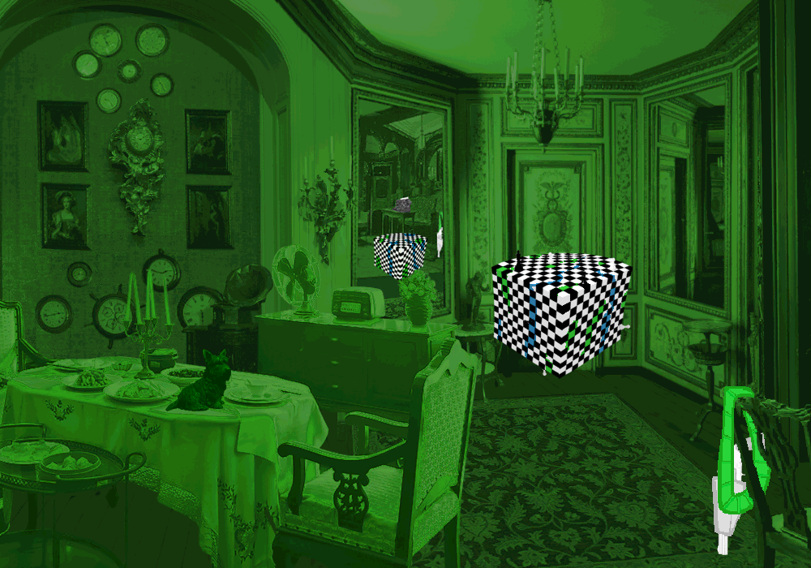

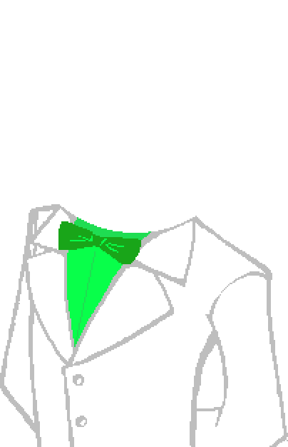

*Doc Scratch's text appears letter by letter, accompanied with a typewriter noise.*

Well, well.

Isn't this a perfectly predictable inevitability?

It certainly has been a while, Vriska. You seem to have blossomed nicely.

Care for a piece of candy?

VRISKA (angry): Oh fuck your stupid candy, you glo8e-headed little freak.

I know for a fact you'd enjoy it, but suit yourself.

VRISKA: Ugh. I had a feeling ages ago that I'd 8e seeing your smug ass again.

The feeling was mutual.

Although it was less the wary hunch of a scared little girl than the delightful certainty that you'd come crawling back to me, sooner or later.

Care to tell me how you've been?

VRISKA: What, like you don't know?

Of course I know. I'm always watching you.

I just figured I'd lend a little weight to the charade of our reintroduction, and allow you a chance to greet me on your own terms.

It's only polite.

VRISKA: You know what?

VRISKA (angry smiling): I've 8een pretty damn good.

VRISKA (angry smiling): 8een losing track of the sweeps I've spent in here fixing pretty much everything other than the thing I actually came in here to fix, 8ut it's paying off!

There's a convenient timer for the express purpose of tracking that.

VRISKA: Yeah, and I never look at it 8ecause it pisses me off!

VRISKA (angry smiling): 8ut it's fine.

VRISKA (angry smiling): It just means I've had a lot of time to think stuff over.

VRISKA (angry smiling): Stuff that was holding me 8ack, throwing me off-course.

VRISKA (angry smiling): Things way more consequential than the 8a8y gru8shit pan-games you used to play with me.

VRISKA (angry smiling): Honestly, I should 8e surprised to even see you here!

VRISKA (angry smiling): Really, all you were doing is sticking your stupid flat face into my REAL 8aggage.

I like to think that I'm far and away the most prolific contributor to your baggage.

VRISKA: You wish!

VRISKA (angry smiling): Man, I figured may8e this place was working up to something really intense, 8ut instead all I get is Glo8ehead the Gru8toucher playing puppetmaster again.

VRISKA (angry smiling): What a joke!

VRISKA (angry smiling): You fucked with a 8unch of little kids and 8lew up, then you LOST.

VRISKA (angry smiling): You could 8arely handle me when I was six, I'm supposed to 8e scared of you NOW?

Well, you're shaking.

VRISKA: THE F8CK I AM!!!!!!!!

VRISKA (angry smiling): Shaking with excitement to get you in my rear-view, may8e!

VRISKA (angry smiling): What is it YOU'RE supposed to teach me?

VRISKA (angry smiling): How to 8e a creepy little pedophile?

VRISKA (angry smiling): How to dress and talk like a fucking tool?

VRISKA (stoic): C'mon!

VRISKA (stoic): Teach me a lesson!

VRISKA (angry): F8cking 8RING IT, you 8ald-ass 8ITCH!!!!!!!!

Exquisite.

I missed that fumbling braggadocio. It's heartening to know that this place hasn't cured you of it yet.

It makes you so much fun to play with.

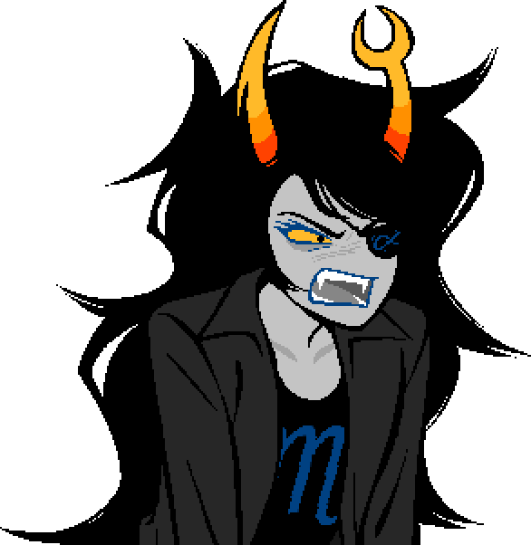

### {o} ==>

*Fade to black.*

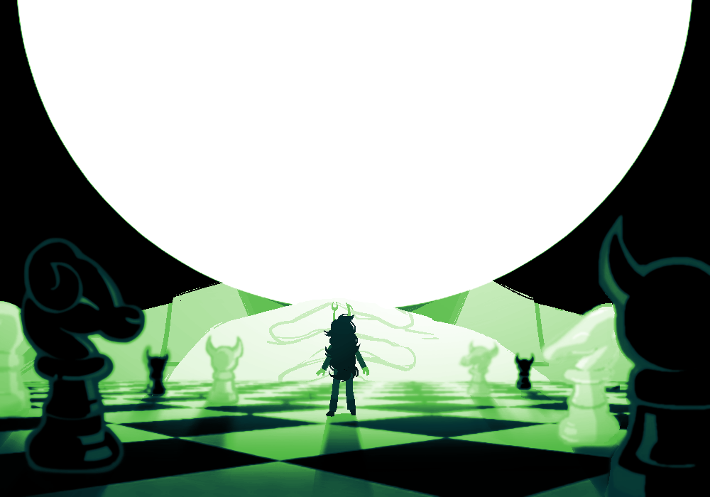

VRISKA: Hey, what the fuck?!

*Doc Scratch's text appears in front of his face.*

There we are.

Now then, why don't we have ourselves a little game?

WHAT WILL YOU DO

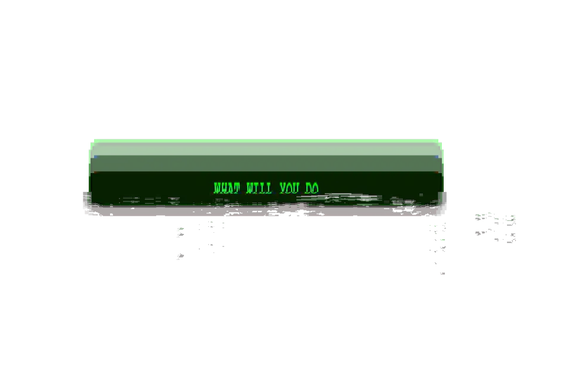

*SFX: Glitch.*

Oh no. We won't be needing that.

Let's get you into your uniform.

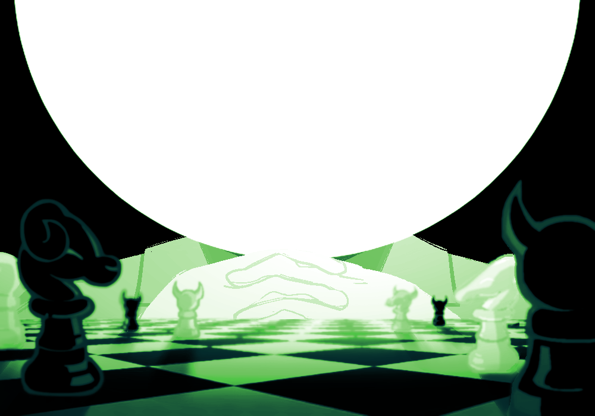
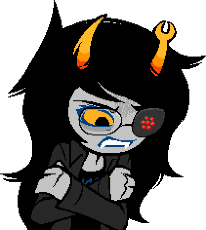

VRISKA: ........

Ah, and there she is. My favorite piece.

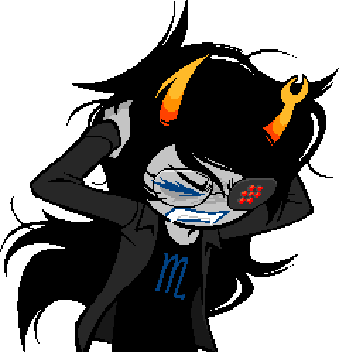

VRISKA: I'm not your piece!

We'll start with a variation of the King's Pawn opening.

Thief to E4; Thief takes Page.

*Vriska jerks to the left. SFX: A bloody impact noise. The screen flashes umber brown.*

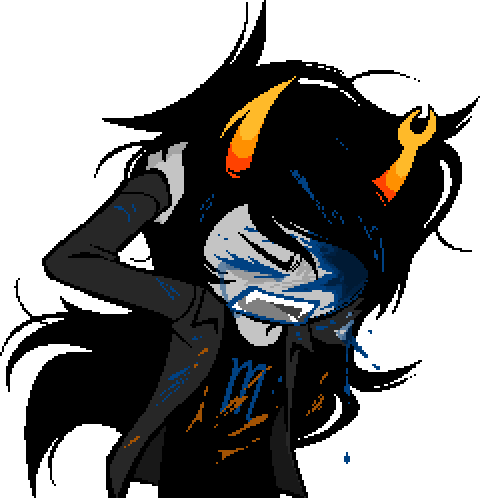

VRISKA: Fuck you!

Thief to F5; Thief takes Maid.

*Vriska jerks to the right. SFX: A bloody impact noise. The screen flashes burgandy.*

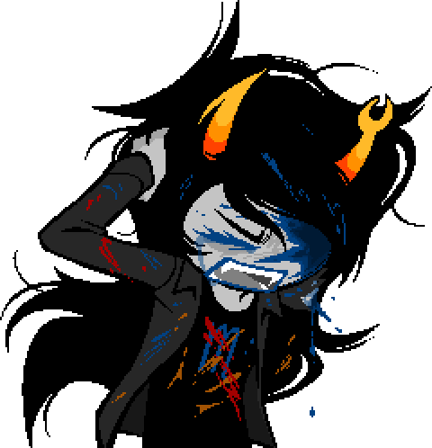

VRISKA: Stop it!

Thief to Z8; Thief takes Seer.

*Vriska jerks to the left. SFX: A bloody impact noise. The screen flashes teal.*

VRISKA: Fucking ST8P 8T!!!!!!!!

VRISKA: Z8 ISN'T EVEN A F8CKING P8SITION, YOU HACK!!!!!!!

All the world's my board.

Thief to ∫40; Thief takes pawn.

*Vriska jerks to the right. SFX: A bloody impact noise, slightly slower. The screen flashes purple.*

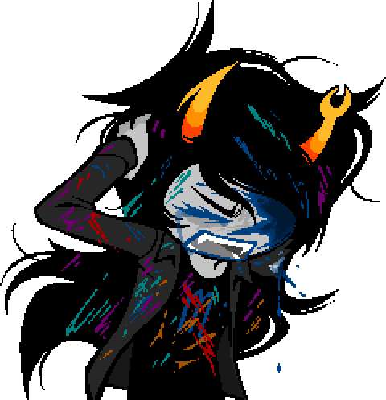

VRISKA: ST8P IT!

Thief to µ22; Thief takes pawn.

*Vriska jerks to the left. SFX: A bloody impact noise, slightly slower. The screen flashes purple.*

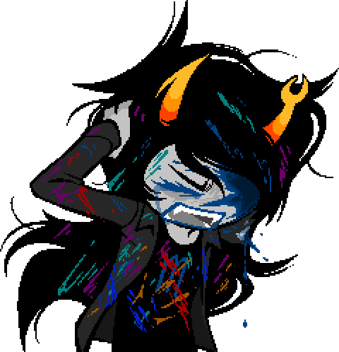

VRISKA: F8CK YOU!

Thief to α612; Thief takes pawn.

*Vriska jerks to the right. SFX: A bloody impact noise, much slower. The screen flashes green.*

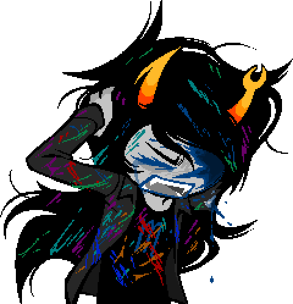

VRISKA: I'LL F8CKING K8LL YOU!

Thief to Ω413; Thief takes pawn. Check.

*Vriska jerks to the left. SFX: A bloody impact noise, much slower. The screen flashes red.*

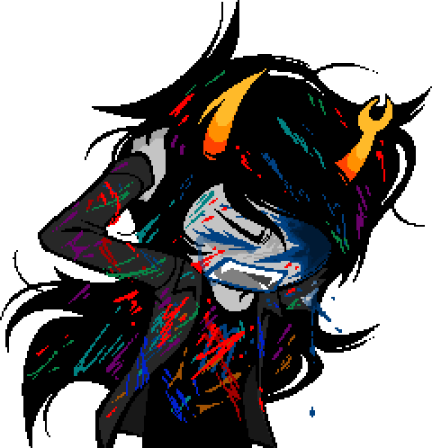

VRISKA: YOU'LL 8E SORRY FOR THIS!

VRISKA: YOU'LL 8E F8CKING SORRY!

VRISKA: YOU'RE A CHEAP FUCKING KARMA GHOST,

VRISKA: THIS IS A STUPID FUCKING CHARADE,

VRISKA: NONE OF THIS MEANS SHIT,

VRISKA: AND I'M NEVER GOING TO 8E CAUGHT UP IN YOUR FUCKING G8MES EVER AGAIN!!!!!!!!

*Vriska begins trembling.*

Of course you will.

You think you're better than me? Better than fate?

Vriska, I am going to put you in situations where you have the potential to do terrible things.

I am going to make things ugly.

I am going to corner you.

I am going to pressure you.

And no matter how much “better” you claim to be, all I have to do is catch you at the wrong moment.

You're one bad turn from burning all your quaint little progress to the ground.

One lapse away from being mine again.

VRISKA: Get me out of here.

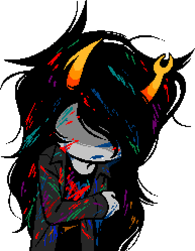

VRISKA (sullen crying): I want a do-over.

Oh, please.

You of all people should know that you don't *get* do-overs.

The rest of these frivolous little vision quests may feel like sparing you the effort of getting things right the first time around, but the real world doesn't work that way.

No, you'll just have to endure it. This won't take long.

You had a good run out there, flying solo and swashbuckling around as if Light itself were yours to command. 

It'd be wise to remember that it's a borrowed blessing.

You flourish at its whim.

Continue to spit in its face and take it for granted, and it will abandon you once again, perhaps for good.

VRISKA: ........

Do you remember who you were, before it chose you?

The choices you made when luck wasn't on your side?

You were such a delectable little victim.

Poor Vriska, with her voracious lusus.

With her demanding legacy and her uncooperative, fickle little friends.

So much was out of your hands, then; how could you help but be my lovely assistant?

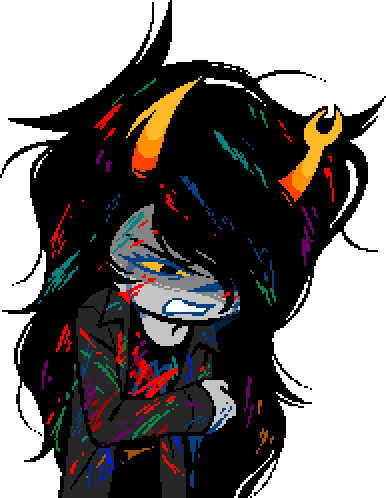

VRISKA: You didn't fucking own me.

*The background flickers and glitches.*

But what matters is that I might as well have.

You let yourself believe you had no option other than to take me up on my hard bargains, again and again.

For all your talk of independence, all your combative posturing and insistence on your own freedom, you barely bothered to put up any actual resistance to my suggestions.

You took the easy way out, swearing all the while it was your move.

What a phenomenal waste of your considerable talents.

VRISKA: I don't need your compliments.

It wasn't a compliment.

It was an insult, and a warning.

You're a trump card, Vriska, but your potency is a double-edged sword.

One you've gotten far too comfortable swinging around, in the past.

What do you intend to fix, when you leave this place?

What, I wonder, will you break?

I'd encourage you to be mindful of both.

Of course, you could always cast aside those pesky trivialities and go with the flow, smashing through circumstance with nary a thought for the consequences.

It'd be easier.

We could dance together again, just like old times.

You choose.

What'll it be, Vriska? Player, or piece?

Thief to ∞108.

*Vriska slowly returns to the center of the frame. The screen fades to white.*

I look forward to finding out.

Good luck.

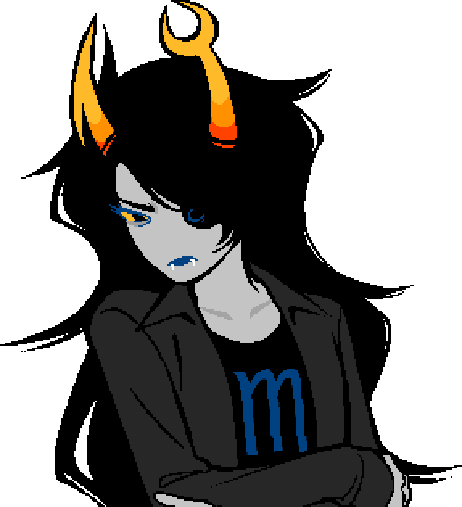

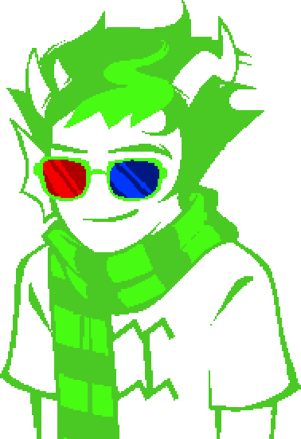

ERISOLSPRITE: oh you totally got traumatiized.

### {Level Complete!}

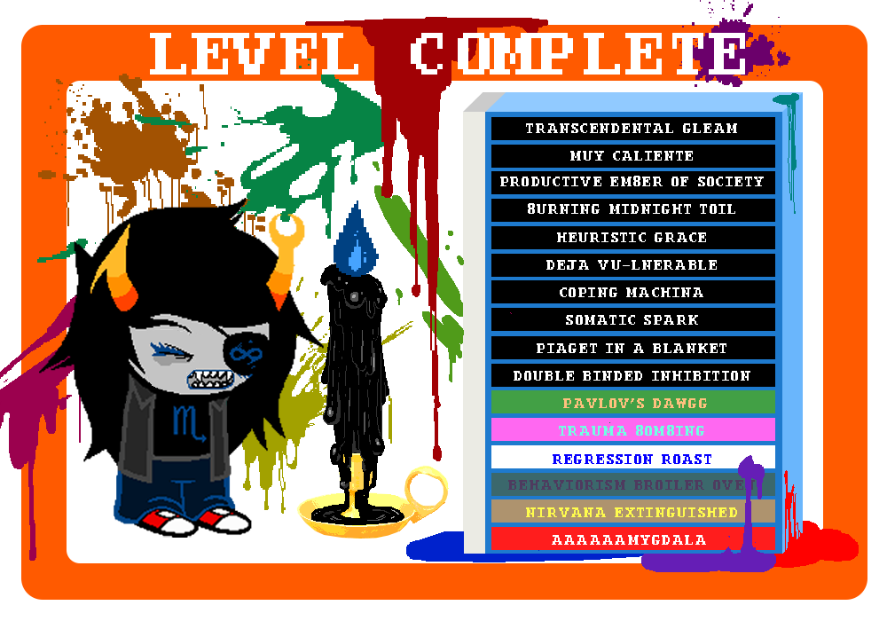