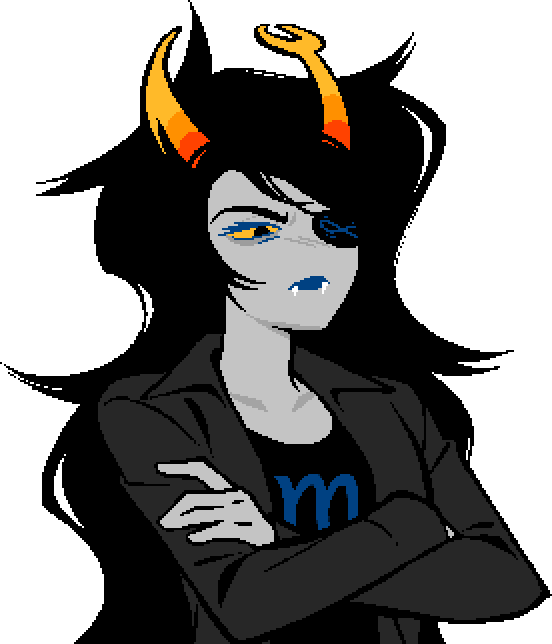
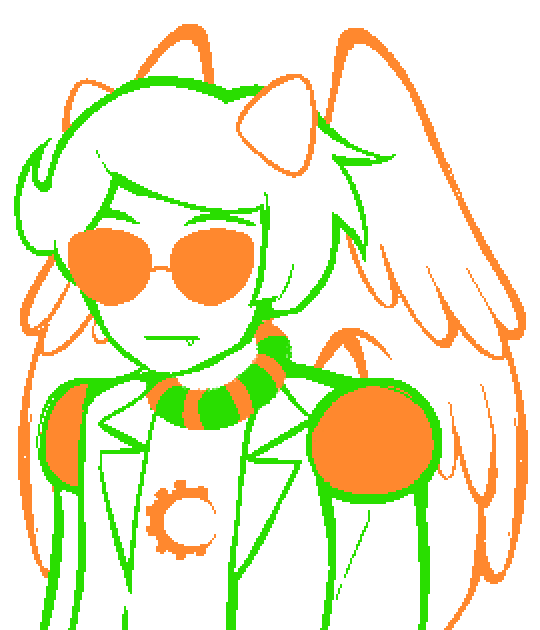

## Chapter 6

*Black background.*

LATER

*Fade to...*

<!-- davepeta neutral onlayer talksprites at right with slideinright -->

DAVEPETASPRITE^2: B33 < well here we are

<!-- davepeta with slideoutright -->

<!-- vriska adult proud onlayer talksprites at left with slideinleft -->

VRISKA (proud): Here we fucking are!

<!-- vriska with slideoutleft -->

<!-- davepeta thinking onlayer talksprites at right with slideinright -->

DAVEPETASPRITE^2 (thinking): B33 < its b33n a long ass time but were cr33ping up behind the grand finale

DAVEPETASPRITE^2 (thinking): B33 < that finale is never gonna s33 it coming

<!-- davepeta with slideoutright -->

<!-- vriska adult smiling onlayer talksprites at left with slideinleft -->

VRISKA (smiling): The final 8oss.

<!-- vriska with slideoutleft -->

<!-- davepeta laugh onlayer talksprites at right with slideinright -->

DAVEPETASPRITE^2 (laugh): B33 < master hand, your days are fucking numbered

<!-- davepeta with slideoutright -->

<!-- vriska adult smiling onlayer talksprites at left with slideinleft -->

VRISKA (smiling): More like minutes!

<!-- vriska with slideoutleft -->

<!-- davepeta neutral onlayer talksprites at right with slideinright -->

DAVEPETASPRITE^2: B33 < finally ready to take that final step

<!-- davepeta with slideoutright -->

<!-- vriska adult smiling onlayer talksprites at left with slideinleft -->

VRISKA (smiling): I needed a 8reather!

<!-- vriska with slideoutleft -->

<!-- davepeta neutral onlayer talksprites at right with slideinright -->

DAVEPETASPRITE^2: B33 < you sure did!

DAVEPETASPRITE^2: B33 < *a tear begins to well up in dps eye behind their shades*

DAVEPETASPRITE^2: B33 < *they f33l like a mom s33ing their freshly pupated charge about to finish their final trials and march off to the subgrubs or maybe a dope ass cave*

DAVEPETASPRITE^2 (thinking): B33 < *dp wonders will they be safe out there? will she make use of all the lessons theyve learned here?*

DAVEPETASPRITE^2 (thinking): B33 < *will she remember to wipe the lid?*

<!-- davepeta with slideoutright -->

<!-- fefeta neutral onlayer talksprites at right with slideinright -->

FEFETASPRITE: 3833 < 383

<!-- fefeta with slideoutright -->

<!-- vriska adult proud onlayer talksprites at left with slideinleft -->

VRISKA (proud): *The Thief proudly puffs out her chest with her hands on her hips and her 8ack to the sun, looking heroic and 8adass.*

VRISKA (proud): Ha! You've got nothing to fear.

VRISKA (proud): I'm older and wiser now.

VRISKA (smiling): I want to thank you, too.

<!-- vriska with slideoutleft -->

<!-- davepeta thinking onlayer talksprites at right with slideinright -->

DAVEPETASPRITE^2 (thinking): B33 < what for

DAVEPETASPRITE^2 (laugh): B33 < i barely did shit

<!-- davepeta with slideoutright -->

<!-- vriska adult smiling onlayer talksprites at left with slideinleft -->

VRISKA (smiling): Haha yeah, 8ut I'm glad you were here anyway.

VRISKA (smiling): You and everyone else!

<!-- vriska with slideoutleft -->

<!-- fefeta neutral onlayer talksprites at right with slideinright -->

FEFETASPRITE: 3833 < 383

<!-- fefeta with slideoutright -->

<!-- vriska adult smiling onlayer talksprites at left with slideinleft -->

VRISKA (smiling): ........

VRISKA (stoic): Okay, I have to say something.

VRISKA: So, DP, you're half Nepeta, right?

<!-- vriska with slideoutleft -->

<!-- davepeta neutral onlayer talksprites at right with slideinright -->

DAVEPETASPRITE^2: B33 < yeah

<!-- davepeta with slideoutright -->

<!-- vriska adult neutral onlayer talksprites at left with slideinleft -->

VRISKA: Well, more of a whole Nepeta, along with a whole other dude.

<!-- vriska with slideoutleft -->

<!-- davepeta neutral onlayer talksprites at right with slideinright -->

DAVEPETASPRITE^2: B33 < ... yeah?

<!-- davepeta with slideoutright -->

<!-- fefeta neutral onlayer talksprites at right with slideinright -->

FEFETASPRITE: 3833 < 383

<!-- fefeta with slideoutright -->

<!-- vriska adult neutral onlayer talksprites at left with slideinleft -->

VRISKA: 8ut Fefeta's also a whole Nepeta!

<!-- vriska with slideoutleft -->

<!-- fefeta neutral onlayer talksprites at right with slideinright -->

FEFETASPRITE: 3833 < ...

<!-- fefeta with slideoutright -->

<!-- vriska adult neutral onlayer talksprites at left with slideinleft -->

VRISKA: So like... how does that work?

<!-- vriska with slideoutleft -->

<!-- davepeta uncomfortable onlayer talksprites at right with slideinright -->

DAVEPETASPRITE^2: B33 < vriska wait dont say it!!!!

<!-- davepeta with slideoutright -->

<!-- vriska adult neutral onlayer talksprites at left with slideinleft -->

VRISKA: Why are there two Nepetas?

<!-- vriska with slideoutleft -->

*SFX: A video game damage noise, and a high pitched squeal.*

<!-- sfx "chapters/6/audio/disappear.ogg" volume 0.75 noloop -->
<!-- fefeta xc onlayer talksprites at right, fadeout with slideinright -->

FEFETASPRITE: 3X(( < 3X((

<!-- fefeta with Dissolve(0.3) -->

<!-- vriska adult confused onlayer talksprites at left with slideinleft -->

VRISKA (confused): ... What the fuck was that?

<!-- vriska with slideoutleft -->

<!-- davepeta pokerface onlayer talksprites at right with slideinright -->

DAVEPETASPRITE^2 (pokerface): B33 < you just fucking sent dear sw33t precious fefeta to sprite city.

<!-- davepeta with slideoutright -->

<!-- vriska adult confused onlayer talksprites at left with slideinleft -->

VRISKA (confused): ????????

<!-- vriska with slideoutleft -->

<!-- davepeta laugh onlayer talksprites at right with slideinright -->

DAVEPETASPRITE^2 (laugh): B33 < hahahaha anyway

DAVEPETASPRITE^2 (laugh): B33 < i was just fucking around earlier but honestly, im actually gonna miss you

DAVEPETASPRITE^2 (cute): B33 < i think im f33ling a goodbye glomp coming on

<!-- davepeta with slideoutright -->

<!-- vriska adult glaring onlayer talksprites at left with slideinleft -->

VRISKA (glaring): Hey hey, we talked a8out this.

<!-- vriska with slideoutleft -->

<!-- davepeta pokerface onlayer talksprites at right with slideinright -->

DAVEPETASPRITE^2 (pokerface): B33 < oh yeah sorry

DAVEPETASPRITE^2 (uncomfortable): B33 < *dp deflates like a cartoon meowbeast thats b33n blown up by some freaky pervert, tied to a balloon, handed off to a snot nosed kid at a theme park who just fucking lets it go because he got distracted by goofy and mickey duking it out (that summer heat makes people crazy)*

<!-- davepeta with slideoutright -->

<!-- vriska adult neutral onlayer talksprites at left with slideinleft -->

VRISKA: Alright fine, one hug 8efore I crush this and I'm outta here.

<!-- vriska with slideoutleft -->

*SFX: Level up!*

DAVEPETASPRITE^2: B33 < yay

*Fade to...*

DAVEPETASPRITE^2: B33 < here you go, your last hell

VRISKA: I've 8een waiting for this one.

VRISKA: I have a pretty good feeling I know who's waiting on the other side.

DAVEPETASPRITE^2: B33 < *sniffs* you're a real pro at this silent hill mind prison shit now, youve come so far

VRISKA: It's 8een real Davepeta, see you around!

DAVEPETASPRITE^2: B33 < good luck vriska!

*Fade to black.*

VRISKA: ...

VRISKA: ...?

VRISKA: Hey!!!!!!!!

<!-- music "chapters/6/audio/terezi_vn.ogg" fadein 1.0 volume 0.5 loop -->

VRISKA: Terezi!!!!!!!!

VRISKA: Is that you?

VRISKA: I knew it would 8e you!

VRISKA: You were the one thing missing from this!

VRISKA: Even if you're just a phantom designed explicitly to torture me, I'm so happy to see-

VRISKA: you...?

    

VRISKA: What?

VRISKA: Who are...

*The music stops.*

<!-- music "chapters/6/audio/11-6.wav" fadein 1.0 volume 0.5 loop -->
<!-- vriska adult glaring onlayer talksprites at left with slideinleft -->

VRISKA: ...

<!-- vriska with slideoutleft -->

<!-- vriska_paren sad onlayer talksprites at right with slideinright -->

(VRISKA): ...

<!-- vriska_paren with slideoutright -->

<!-- vriska adult glaring onlayer talksprites at left with slideinleft -->

VRISKA: ...

<!-- vriska with slideoutleft -->

<!-- vriska_paren sad onlayer talksprites at right with slideinright -->

(VRISKA): ...

<!-- vriska_paren with slideoutright -->

<!-- vriska adult uncomfortable onlayer talksprites at left with slideinleft -->

VRISKA: ........

VRISKA: Alright, fine.

VRISKA: Makes sense I'd have to do this eventually.

VRISKA: I'm sorry.

VRISKA: For all that shit I said to- did to you.

VRISKA: It was wrong of me to hate you for getting soft.

VRISKA: For knowing when to quit.

VRISKA: For choosing to be happy.

VRISKA: I get that now.

<!-- vriska with slideoutleft -->

<!-- vriska_paren hug onlayer talksprites at right with slideinright -->

(VRISKA): ...

<!-- vriska_paren with slideoutright -->

<!-- vriska adult shocked onlayer talksprites at left with slideinleft -->

VRISKA: HUH???????? What the hell...

<!-- vriska with slideoutleft -->

<!-- vriska_paren hug onlayer talksprites at right with slideinright -->

(VRISKA): ...

<!-- vriska_paren with slideoutright -->

<!-- vriska adult uncomfortable onlayer talksprites at left with slideinleft -->

VRISKA: Come on now...

<!-- vriska with slideoutleft -->

<!-- vriska_paren hug onlayer talksprites at right with slideinright -->

(VRISKA): ...

<!-- vriska_paren with slideoutright -->

<!-- vriska adult uncomfortable onlayer talksprites at left with slideinleft -->

VRISKA: You're asking for too much.

VRISKA: You're really going to make me do this?

VRISKA: ...

<!-- vriska with slideoutleft -->

What will you do?

<!-- vriska adult uncomfortable onlayer talksprites at left with slideinleft -->

VRISKA: ...

VRISKA: I...

VRISKA: I won't.

<!-- vriska with slideoutleft -->

<!-- vriska_paren sad onlayer talksprites at right with slideinright -->

(VRISKA): ...

<!-- vriska_paren with slideoutright -->

<!-- vriska adult uncomfortable onlayer talksprites at left with slideinleft -->

VRISKA: I can't.

<!-- vriska adult uncomfortable: -->

<!-- 0.1 xzoom -1.0 xcenter 0.5 xoffset -100 -->
*Vriska turns to the left, and leaves.*
<!-- 0.25 -->
<!-- vriska with slideoutleftslow -->
<!-- music fadeout 3.0 -->

*Fade to white.*

<!-- white with Dissolve(3.0) -->
<!-- 3.5 -->
<!-- music "chapters/6/audio/vrisbeach-dreamy.ogg" fadein 1.0 volume 0.5 loop -->

    
    

<!-- bg vris_beach with Dissolve(2.0) -->
<!-- horses onlayer talksprites with Dissolve(2.0): -->
<!-- 440 -->
<!-- 0.1 -->
<!-- 50.0 xalign 1.5 -->
<!-- pause -->

<!-- music fadeout 3.0 -->
<!-- white onlayer talksprites with Dissolve(3.0) -->
<!-- horses -->
<!-- return -->
